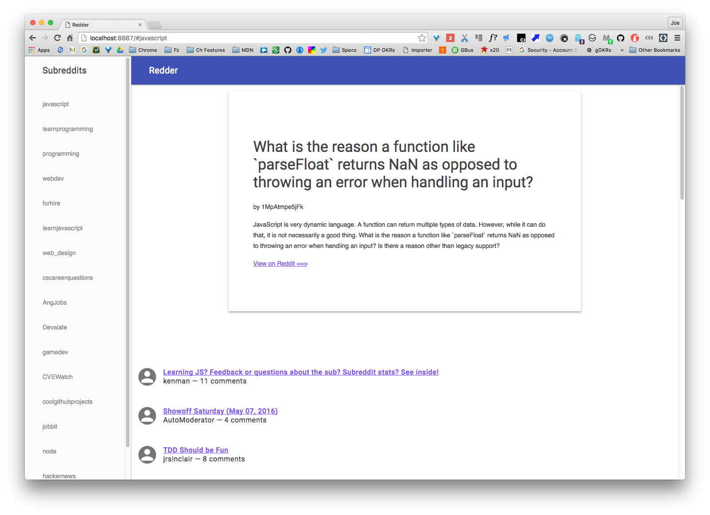

# Redder

Redder is a progressive web app for finding and reading JavaScript-related posts on Reddit.com. It started life as a fork of the [Chrome fetch samples](https://github.com/GoogleChrome/samples/blob/gh-pages/fetch-api/fetch-reddit-demo.js), but has traveled a long way from there. This app is a work in progress whose intended use is a caching codelab.

